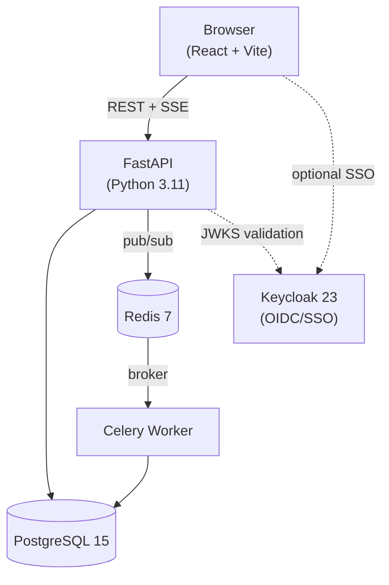
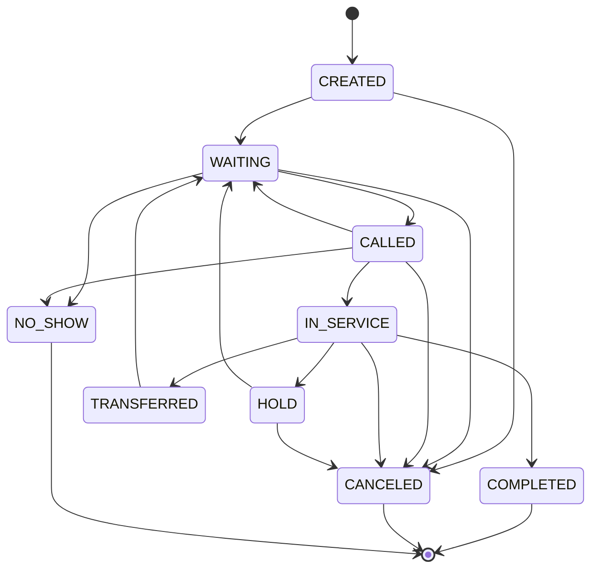

# QueueFlow

> **Multi-site Queue Orchestration Platform with Real-Time Signage, RBAC, and Analytics**

[](https://github.com/your-org/queueflow/actions/workflows/ci.yml)
[](LICENSE)

## Problem Statement

Physical service locations — government offices, healthcare clinics, bank branches — waste customer time and staff energy managing queues manually. QueueFlow provides:

- A **concurrent-safe call-next engine** so operators at multiple counters never call the same customer twice
- **Real-time public signage** so customers know when they're next without checking their phone
- **Multi-tenant isolation** so a single deployment serves dozens of organizations
- **Full audit trails and KPI analytics** so managers can measure and improve service quality

---

## Architecture



See [docs/architecture.md](docs/architecture.md) for detailed sequence diagrams.

### State Machine

Ticket lifecycle follows a strict FSM enforced at both application and database level:



- **WAITING → CALLED → IN_SERVICE → COMPLETED** is the primary flow
- **CALLED → NO_SHOW** for no-shows; **IN_SERVICE → HOLD/TRANSFERRED** for exceptions
- A Postgres trigger rejects illegal transitions; `ticket_events` is append-only (immutable)

### Concurrency Strategy

**Atomic call-next** uses a single SQL statement (CTE) with `FOR UPDATE SKIP LOCKED`:

1. **SELECT** the next WAITING ticket (by priority, created_at) and lock it
2. **UPDATE** status to CALLED, set `called_at`, `assigned_counter_id`
3. **INSERT** into `ticket_events` (append-only audit)
4. **RETURN** the updated ticket

Concurrent staff requests each lock a different row; no duplicate tickets are ever called. Integration tests spawn 25+ concurrent call-next requests against 50 tickets and assert zero duplicates.

---

## Quick Start

### Prerequisites
- Docker + Docker Compose v2

### Run

```bash
git clone https://github.com/your-org/queueflow.git
cd queueflow
cp .env.example .env
make up
make migrate    # first run only
make seed       # optional: demo data
```

Or with raw Docker Compose:

```bash
docker compose up --build -d
docker compose exec api alembic upgrade head
docker compose exec api python scripts/seed.py
```

Services start on:

| Service | URL |
|---------|-----|
| **API + Swagger docs** | http://localhost:8000/docs |
| **Frontend** | http://localhost:3000 |
| **Keycloak admin** | http://localhost:8080 (admin/admin) |
| **PostgreSQL** | localhost:5432 |
| **Redis** | localhost:6379 |

### Seed demo data

```bash
docker compose exec api python scripts/seed.py
```

This creates:
- **Tenant:** Acme Services
- **Location:** Downtown Office (Vancouver timezone)
- **Services:** General (G), Permits (P), VIP (V)
- **Counters:** Counter 1, 2, 3
- **20 demo tickets** in various states

---

## Demo Flows

### Flow 1: Create a ticket and call it

```bash
# 1. Get a DEV token (staff role)
TOKEN=$(curl -s -X POST http://localhost:8000/dev/login \
  -H "Content-Type: application/json" \
  -d '{"email":"staff@queueflow.dev"}' | jq -r .access_token)

# 2. Create a ticket
TICKET=$(curl -s -X POST http://localhost:8000/v1/tickets \
  -H "Authorization: Bearer $TOKEN" \
  -H "Content-Type: application/json" \
  -d '{
    "location_id": "00000000-0000-0000-0000-000000000020",
    "service_id":  "00000000-0000-0000-0000-000000000031"
  }')
echo $TICKET | jq .display_number  # → "G-0001"

# 3. Call next ticket at Counter 1
curl -s -X POST http://localhost:8000/v1/counters/00000000-0000-0000-0000-000000000041/call-next \
  -H "Authorization: Bearer $TOKEN" \
  -H "Content-Type: application/json" \
  -d '{}' | jq '{id,display_number,status}'

# 4. Start service
TICKET_ID=$(echo $TICKET | jq -r .id)
curl -s -X POST http://localhost:8000/v1/tickets/$TICKET_ID/start-service \
  -H "Authorization: Bearer $TOKEN" | jq .status  # → "IN_SERVICE"

# 5. Complete
curl -s -X POST http://localhost:8000/v1/tickets/$TICKET_ID/complete \
  -H "Authorization: Bearer $TOKEN" | jq .status  # → "COMPLETED"
```

### Flow 2: Watch the signage update in real-time

```bash
# In one terminal – subscribe to SSE stream
curl -N http://localhost:8000/v1/signage/00000000-0000-0000-0000-000000000020/stream

# In another terminal – create + call tickets and watch the stream update
```

Or open the browser signage board: http://localhost:3000/signage/00000000-0000-0000-0000-000000000020

### Flow 3: Idempotency

```bash
# Send the same request twice with the same idempotency key
for i in 1 2; do
  curl -s -X POST http://localhost:8000/v1/tickets \
    -H "Authorization: Bearer $TOKEN" \
    -H "Idempotency-Key: my-unique-key-001" \
    -H "Content-Type: application/json" \
    -d '{"location_id":"00000000-0000-0000-0000-000000000020"}' | jq .id
done
# Both requests return the SAME ticket ID
```

---

## API Reference

Full interactive docs at http://localhost:8000/docs

### Auth
```
POST /dev/login          – DEV only: get a JWT for a pre-seeded user
```

### Tickets
```
POST   /v1/tickets                        – Create ticket (idempotency-key supported)
GET    /v1/tickets?location_id=...        – List tickets
GET    /v1/tickets/{id}                   – Get ticket + events
POST   /v1/tickets/{id}/hold             – Hold
POST   /v1/tickets/{id}/cancel           – Cancel
POST   /v1/tickets/{id}/no-show          – Mark no-show
POST   /v1/tickets/{id}/start-service    – Start service (Idempotency-Key supported)
POST   /v1/tickets/{id}/complete         – Complete (Idempotency-Key supported)
POST   /v1/tickets/{id}/transfer         – Transfer to new service
```

### Queue Operations
```
POST /v1/counters/{id}/call-next  – Atomic call-next (Idempotency-Key supported)
```

### Signage (public, no auth)
```
GET /v1/signage/{location_id}           – Point-in-time snapshot
GET /v1/signage/{location_id}/snapshot  – Alias for snapshot
GET /v1/signage/{location_id}/stream    – SSE stream (15s heartbeat, Last-Event-ID reconnect)
```

### Analytics
```
GET /v1/analytics/location/{id}/summary    – KPI summary (avg wait, p95, throughput)
GET /v1/analytics/location/{id}/timeseries – Time-series data
```

### Admin (CRUD)
```
/v1/admin/tenants      /v1/admin/locations   /v1/admin/services
/v1/admin/counters     /v1/admin/channels    /v1/admin/users
```

---

## Dev Users (DEV mode)

| Email | Role | Password (if direct Keycloak) |
|-------|------|-------------------------------|
| admin@queueflow.dev | admin | admin123 |
| manager@queueflow.dev | manager | manager123 |
| staff@queueflow.dev | staff | staff123 |
| viewer@queueflow.dev | viewer | viewer123 |

---

## Testing

```bash
# One-command: start stack, run migrations, run tests
make up
make migrate
make test

# Unit tests only (SQLite in-memory, no DB/Redis)
make test-unit

# Integration tests (requires Postgres + Redis)
make test-integration

# With coverage
make test-cov

# Lint + typecheck
make lint
make typecheck
```

Integration tests include a **concurrency proof** for call-next: 50 WAITING tickets, 25 concurrent requests, assert no duplicate ticket IDs returned.

---

## Database Migrations

```bash
# Apply all pending migrations
make migrate

# Generate a new migration after model changes
make migrate-gen MSG="add_priority_queue"

# Roll back one migration
make migrate-down
```

---

## Design Decisions

| Decision | Choice | Rationale |
|----------|--------|-----------|
| Queue concurrency | Single CTE + `FOR UPDATE SKIP LOCKED` | Atomic select+update+insert+return; no duplicate calls |
| Real-time updates | SSE over WebSocket | Unidirectional, auto-reconnect built in, simpler proxy config |
| Auth | JWT + Keycloak | Industry standard OIDC; DEV fallback for zero-dependency local dev |
| Background jobs | Celery + Redis | Battle-tested; Redis already present for pub/sub |
| State management | FSM + event log | Correctness guarantees + full audit trail |
| Primary IDs | UUID v4 | Safe for distributed systems; no enumeration attacks |

See [docs/adr/](docs/adr/) for full Architecture Decision Records.

### API Versioning

- All endpoints use `/v1` prefix; responses include `X-API-Version: 1`
- Deprecation policy: [docs/VERSIONING.md](docs/VERSIONING.md)

---

## Project Structure

```
queueflow/
├── backend/app/
│   ├── api/v1/          # FastAPI routers
│   ├── core/            # config, security, logging, rate-limiting
│   ├── db/              # async engine + session factory
│   ├── models/          # SQLAlchemy 2.0 ORM models
│   ├── schemas/         # Pydantic v2 request/response models
│   ├── repositories/    # DB access layer (no business logic)
│   ├── services/        # Business logic + RBAC enforcement
│   ├── state_machine/   # Ticket FSM (pure functions, no DB deps)
│   └── workers/         # Celery tasks + beat schedule
├── backend/migrations/  # Alembic migrations
├── backend/tests/       # Unit + integration tests
├── backend/scripts/     # seed.py
├── frontend/src/        # React + Vite + TypeScript
├── docs/                # Architecture, data-model, security, ADRs
├── keycloak/            # Realm export for SSO
├── docker-compose.yml
└── Makefile
```

---

## License

Apache-2.0 – see [LICENSE](../LICENSE)
