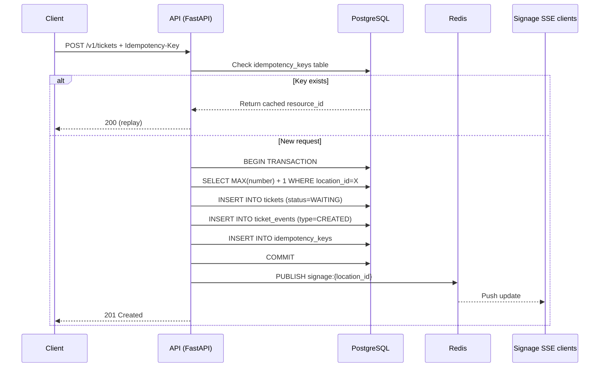
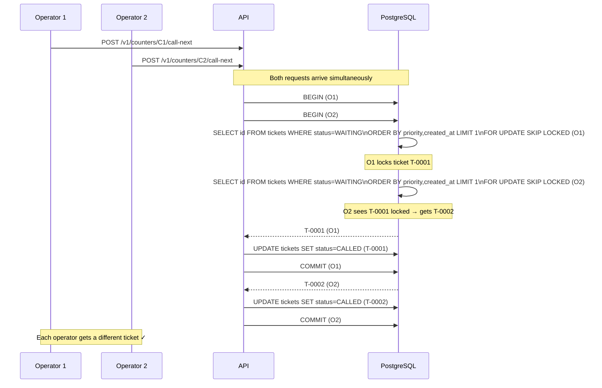
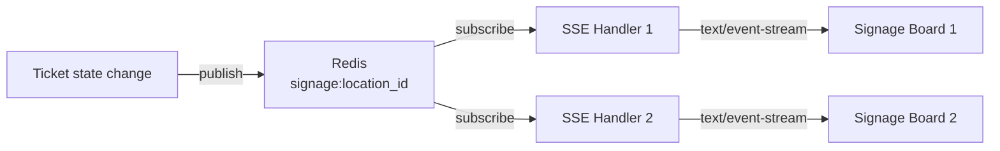

# Architecture

## Overview

QueueFlow is a multi-tenant, multi-location queue orchestration platform.
The system is designed for high reliability and real-time signage updates
with a clean separation of concerns at every layer.

## High-Level Component Diagram

```mermaid
graph TB
    Browser["Browser\n(React + Vite)"]
    Nginx["Nginx\n(Reverse Proxy)"]
    API["FastAPI\n(Uvicorn)"]
    Worker["Celery Worker\n(Background jobs)"]
    Beat["Celery Beat\n(Scheduler)"]
    DB[("PostgreSQL 15\n(Primary data store)")]
    Redis[("Redis 7\n(Pub/Sub + Cache + Broker)")]
    KC["Keycloak 23\n(OIDC / SSO)"]

    Browser -->|HTTP + SSE| Nginx
    Nginx -->|Proxy| API
    Browser -->|OIDC (optional)| KC
    API -->|SQL (asyncpg)| DB
    API -->|Pub/Sub + Cache| Redis
    API -->|JWT validation| KC
    Worker -->|SQL (psycopg2)| DB
    Worker -->|Task results| Redis
    Beat -->|Enqueue tasks| Redis
    Redis -->|Tasks| Worker
```

## Request Flow – Create Ticket



## Request Flow – Call Next (Concurrency-Safe)



## Layered Architecture

```
┌──────────────────────────────────────┐
│  HTTP Routers  (app/api/v1/)         │  Input validation, auth checks
├──────────────────────────────────────┤
│  Services      (app/services/)       │  Business rules, RBAC, orchestration
├──────────────────────────────────────┤
│  Repositories  (app/repositories/)   │  DB queries, no business logic
├──────────────────────────────────────┤
│  Models        (app/models/)         │  SQLAlchemy ORM, indexes, constraints
├──────────────────────────────────────┤
│  PostgreSQL 15 + Redis 7             │  Persistence + pub/sub + cache
└──────────────────────────────────────┘
```

## Signage Real-Time Flow



Each SSE handler:
1. Subscribes to `signage:{location_id}` on Redis
2. Sends an initial snapshot immediately
3. Re-fetches + pushes a new snapshot on every Redis message
4. Sends a heartbeat comment every 30s to keep proxy connections alive

## Multi-Tenancy

Every major entity (location, service, counter, ticket, user) has a `tenant_id`
foreign key. The service layer enforces that actors can only operate on resources
belonging to their own tenant. There is no cross-tenant query at any layer.

## Background Jobs (Celery)

| Task | Schedule | Queue |
|------|----------|-------|
| `kpi_rollup` | Every hour (+5 min) | analytics |
| `cleanup_idempotency_keys` | Daily 02:00 UTC | default |
| `auto_no_show_called_tickets` | Every 10 minutes | default |
