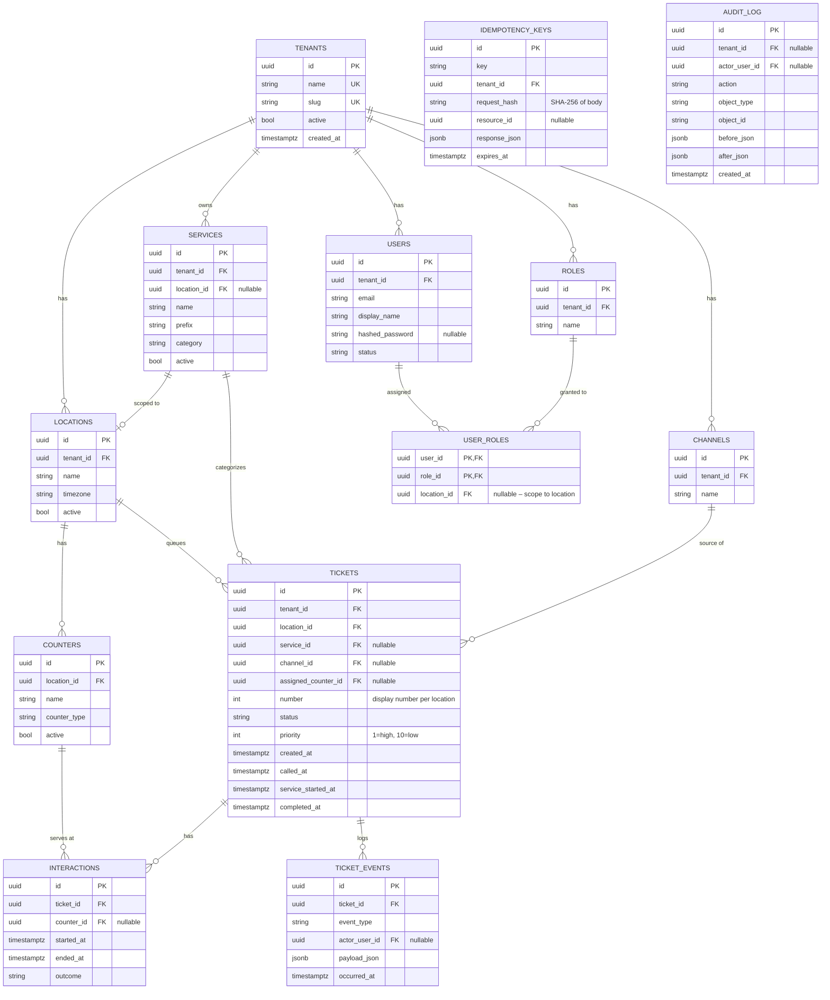

# Data Model

## Entity-Relationship Diagram



## Index Rationale

### `tickets`

| Index | Columns | Rationale |
|-------|---------|-----------|
| `ix_tickets_location_status_created` | `(location_id, status, created_at)` | **Hot path for call-next and queue listing.** The call-next query filters by `location_id` + `status=WAITING` and orders by `priority, created_at`. This covering index prevents a sequential scan on the tickets table even as the table grows to millions of rows. |
| `ix_tickets_service_status_created` | `(service_id, status, created_at)` | Supports service-filtered queue queries common in multi-service locations. Without this, filtering by service would require scanning all tickets for the location. |
| `ix_tickets_tenant_id` | `tenant_id` | Multi-tenancy audit queries and cascade deletes. |
| `ix_tickets_number_location` | `(number, location_id)` | Used to look up a ticket by display number for quick desk lookup. |

### `ticket_events`

| Index | Columns | Rationale |
|-------|---------|-----------|
| `ix_ticket_events_ticket_occurred` | `(ticket_id, occurred_at)` | Every ticket detail page loads the full event history. This composite index enables O(log n) lookup and avoids sort operations on `occurred_at`. |

### `idempotency_keys`

| Index | Columns | Rationale |
|-------|---------|-----------|
| `ix_idempotency_tenant_key` | `(tenant_id, key)` | The idempotency check is on the hot path for every ticket creation request. Must be a fast unique lookup. |
| `ix_idempotency_expires_at` | `expires_at` | The cleanup job runs `DELETE WHERE expires_at < now()`. Without this index it would do a full table scan. |

### `interactions`

| Index | Columns | Rationale |
|-------|---------|-----------|
| `ix_interactions_counter_started` | `(counter_id, started_at)` | Analytics queries compute avg service time per counter over a date range. This supports range scans without a full table scan. |

## Constraints

| Constraint | Location | Reason |
|-----------|----------|--------|
| `ck_tickets_valid_status` | `tickets.status` | DB-level guard against invalid status strings — enforces state machine at the persistence layer too. |
| `ck_tickets_priority_range` | `tickets.priority` | Ensures priority is always 1–10. |
| `uq_idempotency_tenant_key` | `idempotency_keys` | Prevents two concurrent requests with the same key from both inserting. Combined with application-level locking. |
| `uq_users_tenant_email` | `users` | One email per tenant — prevents duplicate accounts. |
| `uq_roles_tenant_name` | `roles` | Prevents duplicate role names within a tenant. |

## Status State Machine

```
CREATED ──────────────────────────────────► CANCELED
   │
   ▼
WAITING ──────────────► CANCELED
   │                     NO_SHOW
   ▼
CALLED ────────────────► NO_SHOW
   │    └──────────────► CANCELED
   ▼                     WAITING (retry)
IN_SERVICE ────────────► COMPLETED
   │        └──────────► CANCELED
   │        └──────────► HOLD ──► WAITING
   └────────────────────► TRANSFERRED ──► WAITING
```

**Terminal states:** `COMPLETED`, `CANCELED`, `NO_SHOW` — no further transitions.

## Ticket Number Generation

The `number` field is a sequential integer scoped per location (not globally unique). The API uses:

```sql
SELECT COALESCE(MAX(number), 0) + 1 FROM tickets WHERE location_id = ?
```

This runs within the same transaction as the INSERT, making it safe under concurrent inserts. The human-readable form is `{service.prefix}-{number:04d}`, e.g. `G-0042`.
